# Baie Ternay Marine Park mapping

**Survey period: December 2021–January 2022.**

High-resolution mapping of Baie Ternay Marine Park, Mahé, Seychelles, conducted in December 2021 and January 2022. The project combines drone surveys acquired on 11–12 December 2021 (70 m, 30 m and 10 m nominal flight altitudes) with close-range underwater reef photogrammetry carried out during January 2022.

**This repository contains preview imagery only.** It includes lightweight images for browsing in this README and higher-resolution preview JPEGs for download. The full original image datasets, full-resolution orthomosaics, georeferenced GeoTIFFs and other processing outputs are available on request.

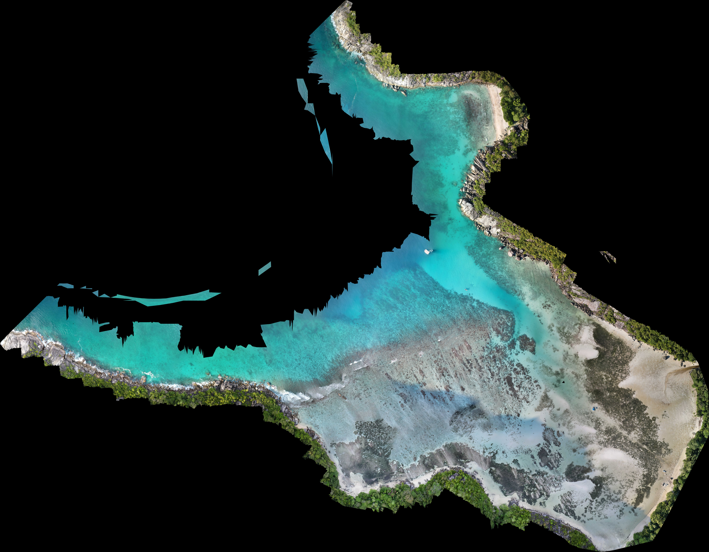

*Lower-resolution preview of the 70 m orthomosaic. Black areas contain no reconstructed imagery. The georeferenced full-resolution GeoTIFF is available on request.*

[Watch the 79-second mapping overview](assets/video/mapping-overview.mp4)

## Dataset at a glance

| Survey | Acquisition | Images | Pattern / overlap | Nominal orthomosaic resolution |
|---|---|---:|---|---:|
| Full bay | DJI Mavic Air 2, 70 m altitude, 30 km/h | 1,604 | S-pattern, 75% overlap | 2.5 cm/px |
| Large reef area | DJI Mavic Air 2, 30 m altitude, 6 km/h | 1,052 | S-pattern, 85% overlap | 1.1 cm/px |
| Reef detail | DJI Mavic Air 2, 10 m altitude, 5 km/h | 324 | Grid pattern, 85% overlap | 0.4 cm/px |
| Underwater reef | Olympus TG-6, approximately 1 m above the seafloor | 2,605 | Three adjoining sections | approximately 1.9 mm/px |

The drone imagery was acquired on 11–12 December 2021. The underwater survey was conducted during January 2022.

## Study area and georeferencing

The project is centred on [Baie Ternay, Mahé, Seychelles](https://www.openstreetmap.org/?mlat=-4.637902&mlon=55.373767#map=15/-4.637902/55.373767). Drone orthomosaics are georeferenced in **WGS 84 / UTM zone 40S (EPSG:32740)**.

| Orthomosaic | Raster extent on the ground | WGS 84 bounds (west, south, east, north) |
|---|---:|---|
| 70 m full bay | approximately 1,577 × 1,227 m | `55.366650, -4.643432, 55.380885, -4.632371` |
| 30 m reef area | approximately 202 × 223 m | `55.375748, -4.640630, 55.377576, -4.638618` |
| 10 m reef detail | approximately 31.4 × 31.4 m | `55.377100, -4.639419, 55.377383, -4.639136` |

Bounds and pixel sizes were read from the source GeoTIFF metadata. They describe the raster canvases, which can include transparent or empty margins beyond reconstructed image coverage.

## Methodology

### Drone surveys

All drone mapping routes were programmed before takeoff with a flight-planning application and then flown according to the planned lines and image overlap.

The original field notes record the following acquisition details:

- **70 m full-bay survey:** flown on 11 and 12 December 2021 between approximately 16:45 and 17:45, around one hour before sunset. Full-bay coverage required three separate flights using three batteries. The drone flew at 70 m and 30 km/h in an S-pattern with 75% overlap. The survey produced 1,604 photographs and a 2.5 cm/px orthomosaic.
- **30 m large reef-area survey:** flown on 12 December 2021 from approximately 06:20 to 07:05, around 30 minutes after sunrise. The drone flew at 30 m and 6 km/h in an S-pattern with 85% overlap. The survey produced 1,052 photographs and a 1.1 cm/px orthomosaic.
- **10 m reef-section survey:** flown on 12 December 2021 from approximately 17:50 to 18:10, around 20 minutes before sunset. The approximately 15-minute survey covered 0.06 ha at 10 m altitude and 5 km/h, using a grid pattern with 85% overlap. It produced 324 photographs and a 0.4 cm/px orthomosaic.

All drone photographs are 4,000 × 3,000 pixels (12 MP), recorded with a **DJI Mavic Air 2** using its FC3170 camera at 4.5 mm focal length (24 mm full-frame equivalent) and f/2.8. Camera settings varied automatically with the available light:

- 70 m survey: ISO 100–210, shutter speed 1/640–1/15 s; flown near sunset over two days.
- 30 m survey: ISO 100–130, shutter speed 1/250–1/15 s; flown around sunrise.
- 10 m survey: ISO 100–110, shutter speed 1/160–1/60 s; flown near sunset.

The 70 m survey established full-bay context. The 30 m and 10 m surveys progressively increased spatial detail over the selected reef area. The source photographs' embedded GPS positions were used by WebODM to generate the georeferenced orthomosaics.

### Underwater photogrammetry

The underwater survey covered an approximately 27 m-long by 6 m-wide reef strip, processed as three adjoining sections of roughly 6 × 9 m each. A 50 cm graduated PVC bar was placed in each section for scale, and measuring tape marked the edge of the survey area.

The underwater acquisition took place during January 2022, but the exact date or dates are not known. Date fields in the edited JPEG files are not treated as evidence of the field date because they may reflect the image-processing or export workflow.

The 2,605 Olympus TG-6 photographs are 4,000 × 3,000 pixels. The camera was held approximately 1 m above the seafloor at 5.4 mm focal length (30 mm full-frame equivalent). EXIF metadata records ISO 100–160, f/2.3–f/3.2, shutter speeds from 1/250 to 1/60 s, and that the flash was disabled throughout.

Before reconstruction, the underwater images were sorted into batches with similar visual and lighting conditions. Each batch received a consistent RawTherapee treatment, including colour and exposure/illumination corrections appropriate to that group, and was then exported with RawTherapee 5.8. This reduced within-group appearance differences while allowing different conditions to receive different corrections.

Each section was reconstructed in WebODM. Because the underwater photographs contain no usable GPS positions, their initial reconstructions had no valid geographic placement. Derived underwater orthomosaics were then manually positioned and reshaped over the 70 m drone orthomosaic using visible reef features and the **Freehand Raster Georeferencer plugin for QGIS**. During this placement, the orthomosaics were scaled to the correct physical dimensions by checking the lengths of the graduated 50 cm PVC bars and measuring tapes visible in the imagery. Their absolute position should nevertheless be treated as approximate rather than as an independent survey-grade measurement.

### Registration on the 70 m orthomosaic

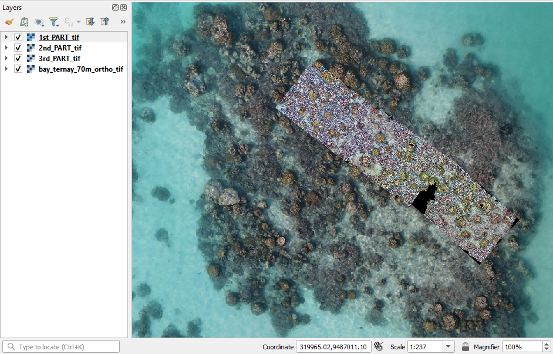

*QGIS view of the three underwater sections after scaling and manual placement on the georeferenced 70 m drone orthomosaic.*

## Preview gallery

### 70 m full-bay details

| Reef detail | Seagrass detail |
|---|---|
| [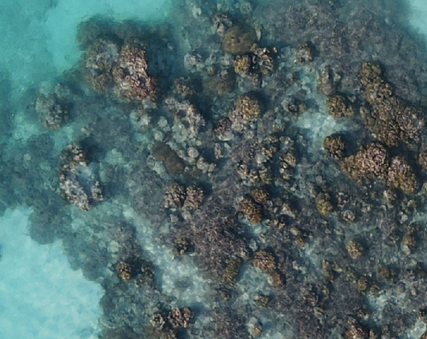](assets/maps/70m_detail_reef.png) | [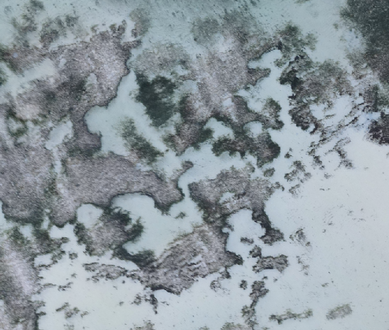](assets/maps/70m_detail_seagrass.png) |

*Detail views from the 70 m full-bay orthomosaic. Click either image to inspect it at full size.*

| 30 m reef area | 10 m reef detail |
|---|---|
| 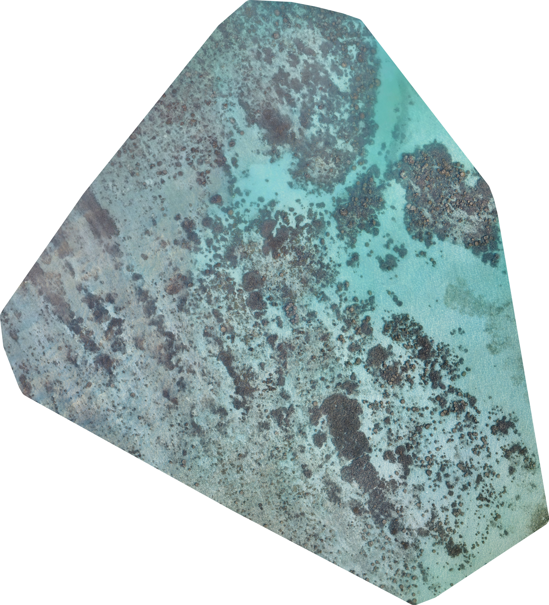 | 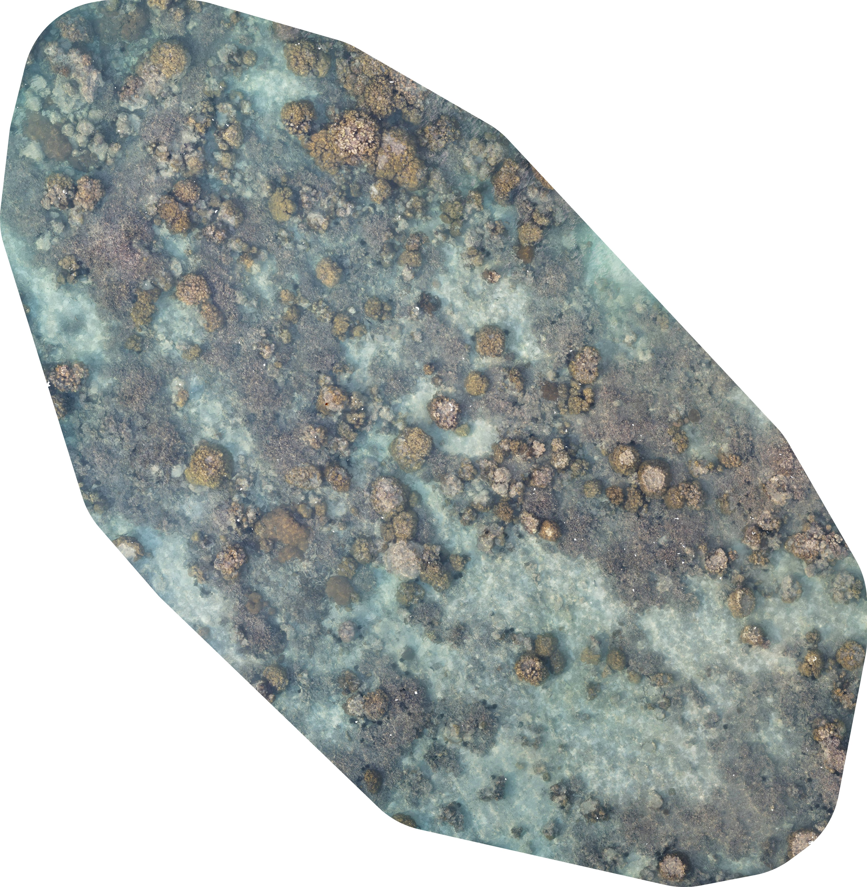 |

| Underwater section 1 | Underwater section 2 | Underwater section 3 |
|---|---|---|
| 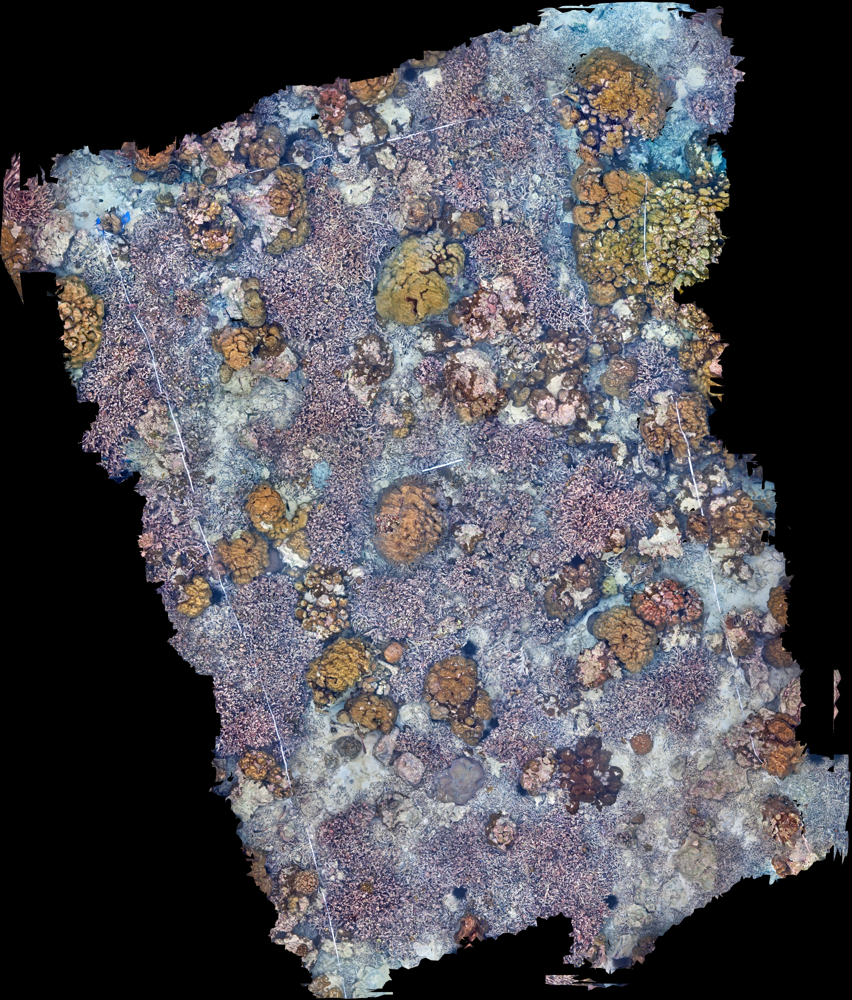 | 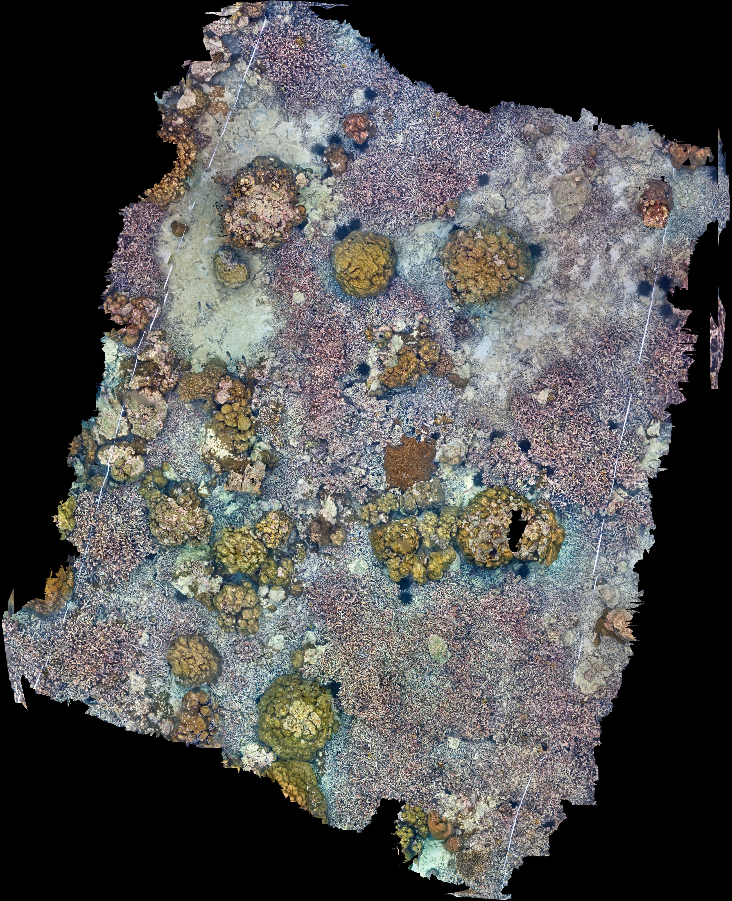 | 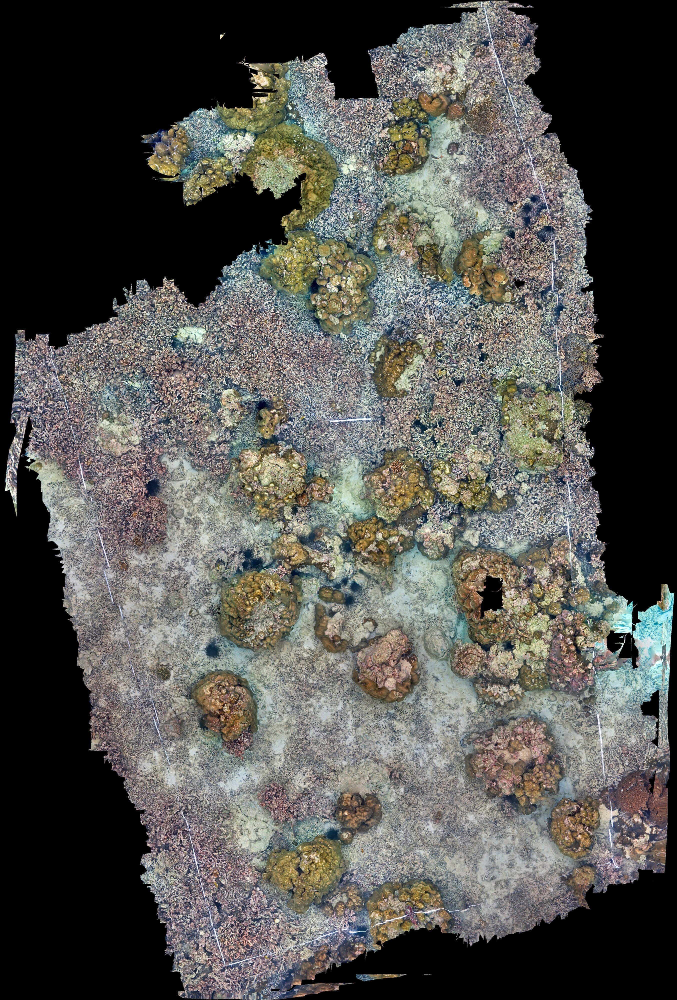 |

### Native-pixel underwater detail

[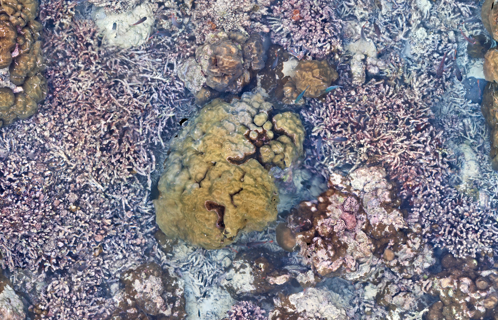](assets/maps/underwater-detail-native-pixels.png)

*A 2,800 × 1,800-pixel crop from the full-resolution 7,992 × 9,374-pixel section 1 orthomosaic. The crop retains the source pixels without AI generation, sharpening, colour adjustment or resizing. Click the image to inspect the detail at full size.*

#### Closer underwater detail

[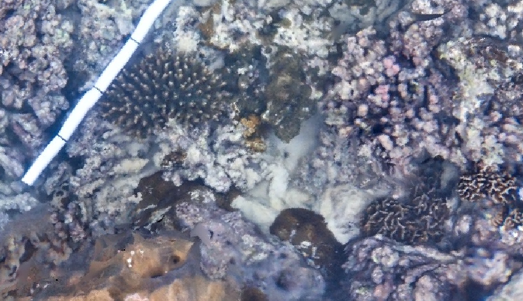](assets/maps/underwater-detail-native-pixels-2.png)

*A tighter view of the underwater orthomosaic showing individual coral structures and a graduated PVC scale bar at left. Click the image to inspect it at full size.*

## Data access

The images displayed directly in this README are reduced previews. The higher-resolution preview files from the original project folder that fit within GitHub's regular 100 MiB per-file limit are also stored in the repository:

- **[Browse the higher-resolution previews in the repository](assets/higher-resolution-previews)**
- **[Download the complete higher-resolution preview collection](https://github.com/GillesGaelBERNARD/baie-ternay-mapping/releases/tag/high-resolution-jpegs-v1)**

The complete Release contains 12 preview files: the full-bay, 30 m, 10 m and three underwater orthomosaic JPEGs, together with the example photographs. The 111 MB full-bay preview exceeds GitHub's regular Git file limit, so it is available in the Release but is not tracked inside the repository. All of these JPG/JPEG files are still preview derivatives—not the original full-resolution products—and are not georeferenced.

The following full-resolution material can be requested:

- complete original drone image datasets for the 70 m, 30 m and 10 m surveys;
- complete edited Olympus TG-6 underwater photogrammetry dataset;
- full-resolution orthomosaics and georeferenced GeoTIFF files; and
- additional processing outputs, subject to availability.

Examples of the larger requestable raster files are:

| Requestable file | Approximate size |
|---|---:|
| Underwater orthomosaic GeoTIFF — part 1 | 322 MB |
| Underwater orthomosaic GeoTIFF — part 2 | 394 MB |
| Underwater orthomosaic GeoTIFF — part 3 | 293 MB |
| Full-bay 70 m drone GeoTIFF | 2.19 GB |

To request data, [open a data-request issue](https://github.com/GillesGaelBERNARD/baie-ternay-mapping/issues/new?template=data-request.yml) and describe the dataset, intended use and preferred format. GitHub issues are public, so do not include private contact details; a private contact route can be arranged after the initial request. No explicit reuse licence is currently attached to the source datasets, so please also state the intended reuse and attribution.

## Limitations

- The drone products rely on embedded consumer-drone GPS positions; no RTK, PPK or ground-control-point workflow is documented.
- Water-surface movement, refraction, depth and changing illumination can introduce geometric and radiometric artefacts.
- The underwater products were manually aligned to the drone orthomosaic and are not independently georeferenced.
- Nominal spatial resolutions describe output pixel size, not guaranteed positional or measurement accuracy.
- These products are for documentation and research use, not navigation.

## Field image examples

These lightweight examples show the source imagery used for the reconstructions. Click an image to open the larger README copy; higher-resolution preview versions are available in [`assets/higher-resolution-previews/examples`](assets/higher-resolution-previews/examples).

### Drone survey photographs

| 70 m survey — example 1 | 70 m survey — example 2 |
|---|---|
| [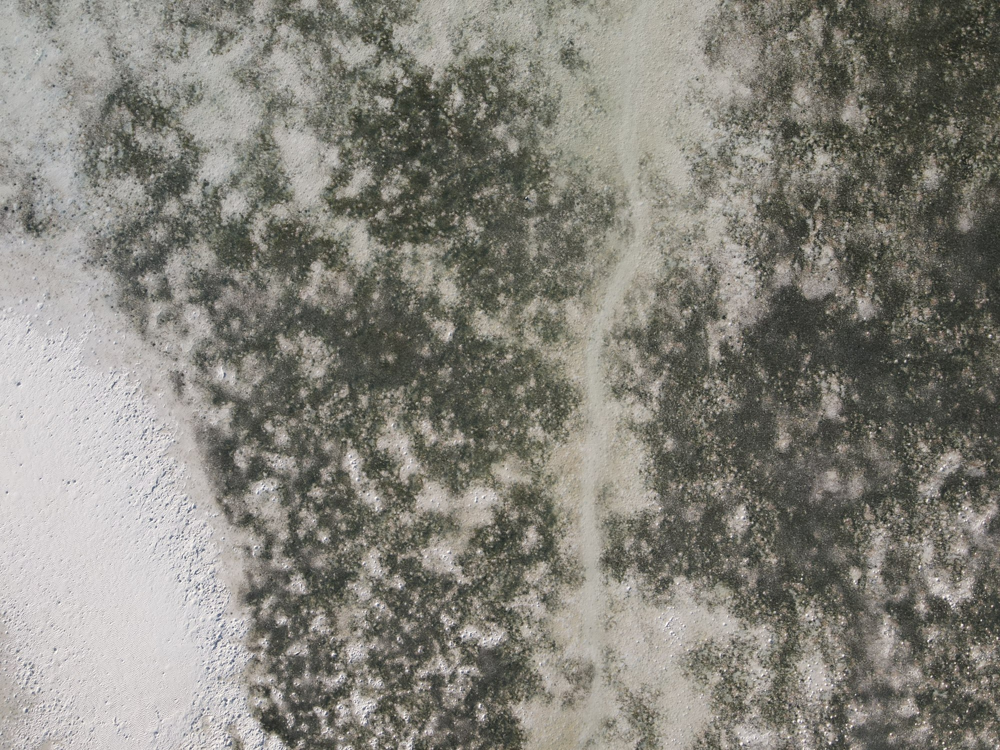](assets/field-images/drone-70m-01.jpg) | [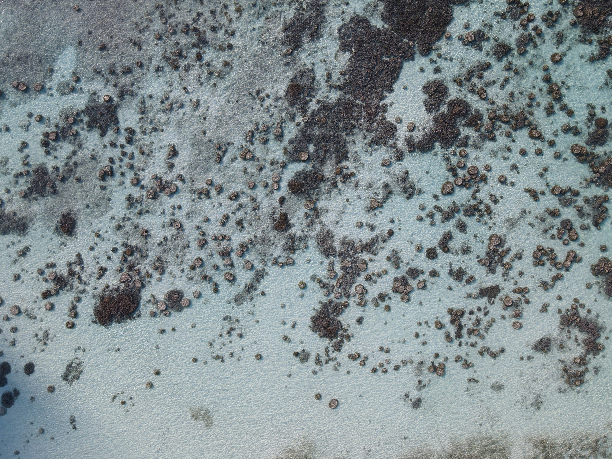](assets/field-images/drone-70m-02.jpg) |

| 30 m reef survey | 10 m reef-detail survey |
|---|---|
| [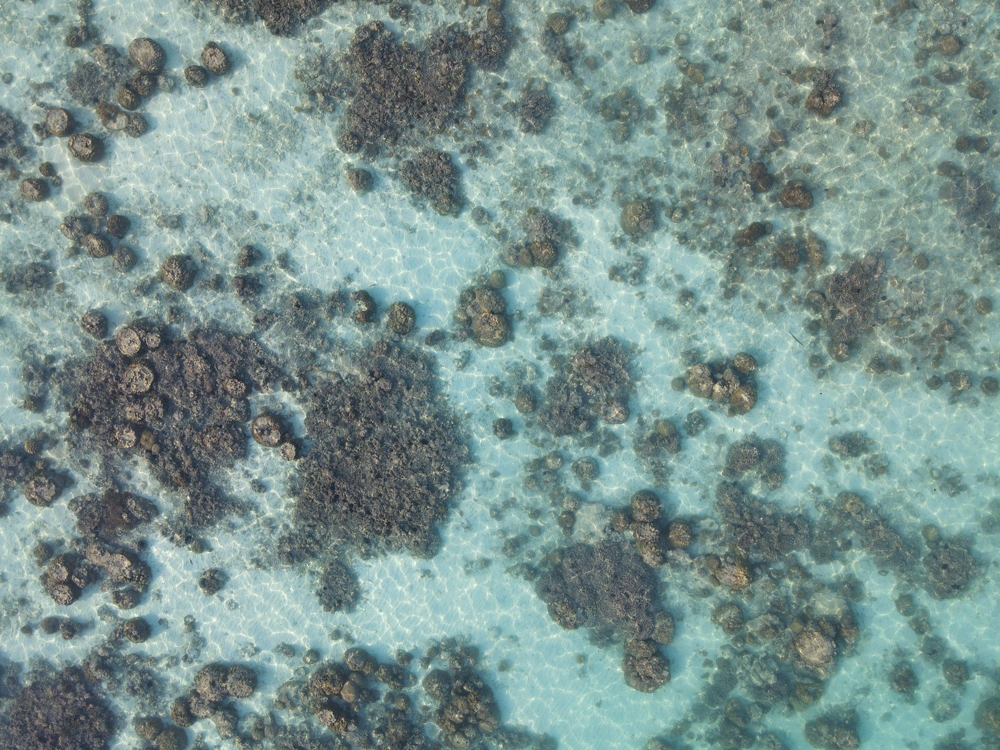](assets/field-images/drone-30m.jpg) | [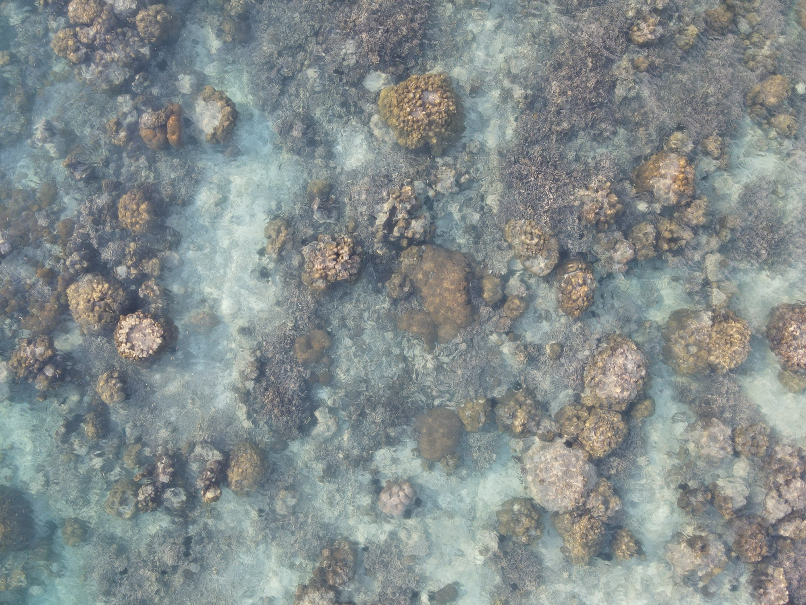](assets/field-images/drone-10m.jpg) |

### Underwater survey photographs

| Underwater example 1 | Underwater example 2 |
|---|---|
| [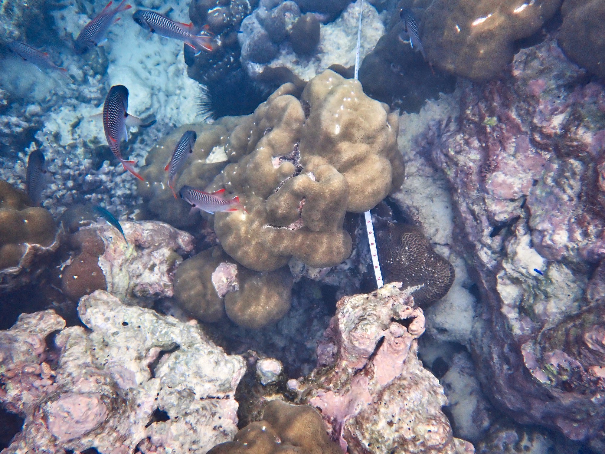](assets/field-images/underwater-01.jpg) | [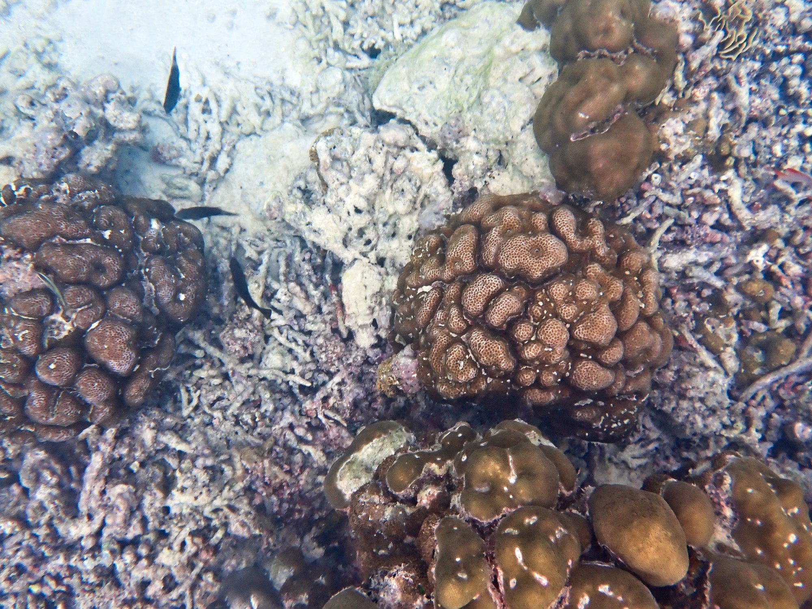](assets/field-images/underwater-02.jpg) |

## Repository contents

```text
assets/
  field-images/                Lightweight example photographs
  higher-resolution-previews/  Downloadable preview exports that fit in Git
  maps/                        README-optimized orthomosaic previews
  video/                       Compressed project overview
.github/
  ISSUE_TEMPLATE/ Data-request form
README.md          Project description and methodology
```

Project owner: [GillesGaelBERNARD](https://github.com/GillesGaelBERNARD)
